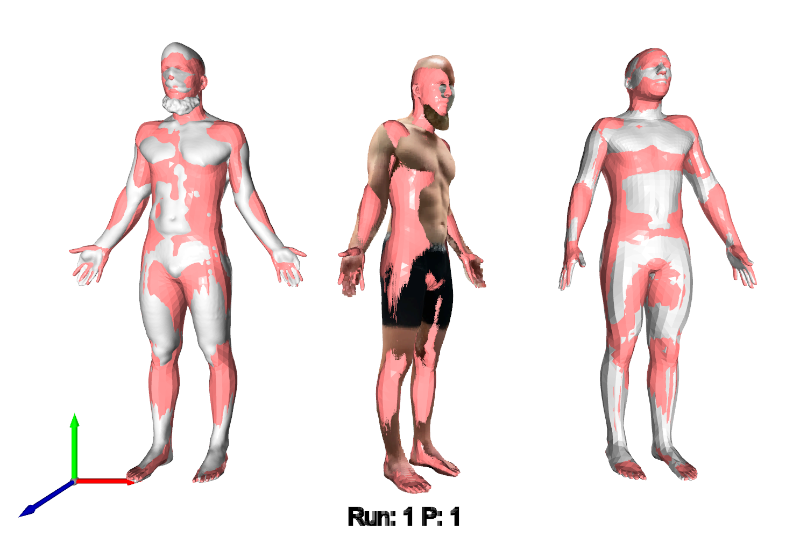
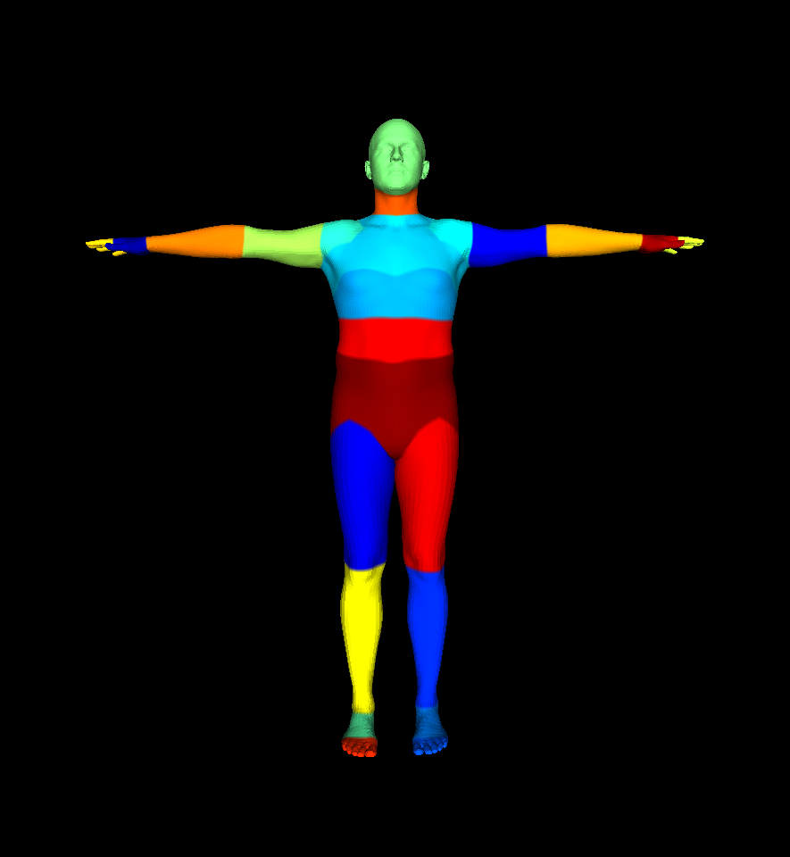
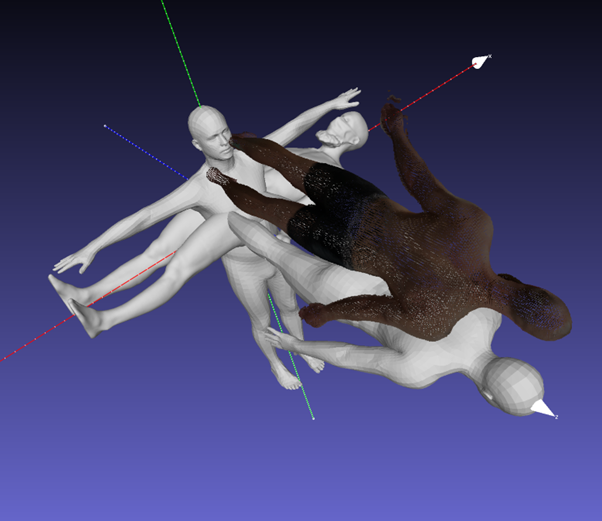
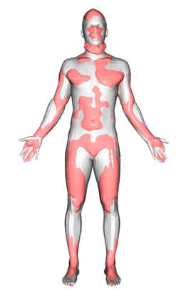
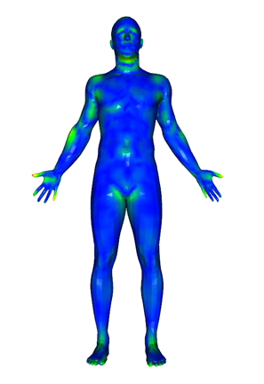
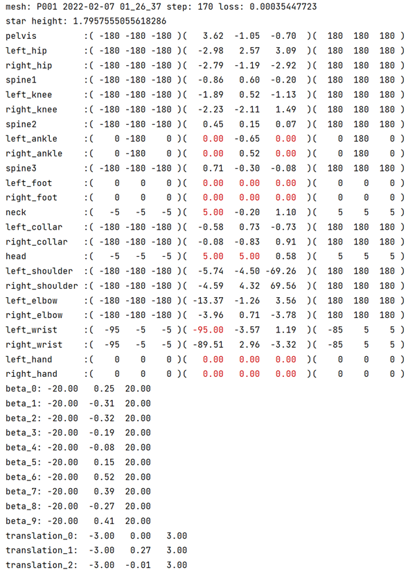

# STAR model fitting

Conrad Werkhoven, May 2023  
conrad.werkhoven@auckland.ac.nz   
Musculoskeletal Modelling Group  
Auckland Bioengineering Institute

## Introduction

This code can be used to fit the STAR body model (<https://star.is.tue.mpg.de/>) to a scan.

The repo contains a simple example: *star_body_model_fitting_simple_example.py* and a more complicated example,
*star_body_model_fitting_AUT.py* as used in the paper:

Evaluating the accuracy of low-cost scanning technology to reconstruct full body morphology  
by Julie Choisne, Conrad Werkhoven, Thor Besier, Kelly Sheerin and Hannah Wyatt  
presented at the ABC13, 13th Australasian Biomechanics Conference in Nov 2022.

In this paper we compare three scanning methods: two low-cost methods, namely, lidar and a zozo suit, and a more
expensive 3D laser scanner. First, we fit each scan with the STAR body model, then, by moving the STAR model to the
default zero-pose position we can do a comparison between the lidar and zozo suit with the 3D laser scanner.


Figure 1. Fitting the STAR body model to scans from: left) the AUT (Auckland University of Technology) 3D Scanner,
middle) a lidar scanner 3) a zozo suit.

## The STAR body model

Info on the STAR (A Sparse Trained Articulated Regressor) model is available here:

<https://star.is.tue.mpg.de/> and

<https://ps.is.mpg.de/uploads_file/attachment/attachment/618/star_paper.pdf>

“STAR is a vertex-based linear-blend skinning (LBS) model complemented with a learned set of shape and pose corrective
functions. The STAR body model has its origins in SMPL (Skinned Multi-Person Linear Model). SMPL augments traditional
LBS with pose-dependent corrective offsets that are learned from 3D scans… STAR (Sparse Trained Articulated Regressor)
is more accurate than SMPL yet has sparse and spatially local blend shapes, such that a joint only influences a sparse
set of vertices that are
geodesically close to it.”

The STAR body model is a function of 24 joints and 10 shape components. The initial pose can therefore be described by a
24x3 array.

  
Figure 2. The SMPL model (<https://smpl.is.tue.mpg.de/>)

STAR_JOINT_NAMES = ['pelvis', 'left_hip', 'right_hip', 'spine1', 'left_knee', 'right_knee', 'spine2', 'left_ankle',
'right_ankle', 'spine3', 'left_foot', 'right_foot', 'neck', 'left_collar', 'right_collar', 'head', 'left_shoulder',
'right_shoulder', 'left_elbow', 'right_elbow', 'left_wrist', 'right_wrist', 'left_hand', 'right_hand']

## License

The original STAR license can be viewed here:

<https://star.is.tue.mpg.de/license.html>

Notably, the software is to be used for non-commercial scientific research purposes only.

Likewise, the fitting software described in this document is to be used for non-commercial scientific research purposes
only.

## Fitting of the STAR model to a scan

As STAR is defined in terms of pytorch variables, we can conveniently use pytorch to fit STAR to another mesh. We use
the pytorch3D loss function point_mesh_face_distance to define the loss between a point cloud (either using the original
lidar scan point cloud or a sampled point cloud from the original mesh in the case of the 3d laser scanner or the zozo
suit) and the STAR mesh. This loss function is then minimized relative to the pose and body shape parameters of the STAR
model using stochastic gradient descent in pytorch.

## Using constraints to guide fitting

Rather than adjust all body parameters simultaneously, we place and relax constraints on a particular body area of the
STAR model at different stages of the fitting to guide the optimization. Typically, we first roughly adjust the initial
pose to match the original scan. Then we allow the STAR model to translate in space relative to the target scan, then we
allow the STAR model to rotate about the pelvis, then we fit the pose and then the shape, finally we remove all
constraints for the final fitting.

## Coord system and Initial Pose

The STAR model is described by a RHS coordinate system. Starting at the zero-pose position each joint can be rotated
around each axis in a manner described by the right-hand rule.

Typically, the person being scanned takes on an inverted V shape with their arms. We can set the initial pose of the
STAR model to match this pose as follows:

The left shoulder is the 16th joint (assuming we start counting at 0) so the left shoulder pose is defined by entries
48, 49 and 50 in the 72 element pose array. If we assume the arm is 70 degrees from the horizontal then the rotation
around the left shoulder is [0, 0, -70] and likewise for the right shoulder is [0, 0, -70].

The initial pose can be set in the file: *star_body_models_initial_pose_and_constraints.py*.
mentioned below

We set pose lower and upper limits so that the pose remains within the set of realistic poses.

## Running the Code

To run the code we need to

1. Download and install the code
2. Download and install the sample data
3. Set up a python environment
4. Make sure the folders in the code point to the correct folders
5. Run either star_body_model_fitting_simple_example.py or star_body_model_fitting_AUT.py

## Installing the Code

Clone or download from:

<https://github.com/ConradW01/STAR_body_model_fitting.git>

## File Descriptions

The STAR body model fitting repository contains the following files:

***1. star_body_model_fitting_simple_example.py***

A simple example used to demonstrate the fitting of the STAR body model to a scan

***2. star_body_model_fitting_AUT.py***

The main file: imports the initial scans, runs the fitting optimization, calculates the surface-to-surface distance
metrics, and saves off the STAR model results.

***3. star_body_model_fitting_AUT_sample_data.ini***

The configuration file containing folder names and constants etc. used by *star_body_model_fitting_AUT.py.*

***4. star_body_model_optimiser.py***

The optimization code.

***5. star_body_model_utils.py***

The utilities library.

***6. star_body_models_initial_pose_and_constraints.py***

Contains the STAR model initial pose.

***7. star_body_model_surface_to_surface_distance.py:***

This file is part of gias2:

<https://gias2-shape-modelling-tutorial.readthedocs.io/en/latest/gias2.html><a name="_hlk132365653"></a>

and is used to calculate the dice and jaccard score for two meshes using the surf2surf_dist function in the utils.py
script. I have taken a local copy of *surface_to_surface_distance.py* and amended the function calcSegmentationErrors as
follows:

I have changed the constants in the function calcSegmentationErrors from 10 to 0.1

The 10 is suitable when spacing is in units of mm, but causes a crash when things are in meters, so the following two
lines have changed from the original:

```python
imgOrig = volMin - 0.1

imgShape = np.ceil(((volMax + 0.1) - imgOrig) / jacImgSpacing).astype(int)
```

At some point in the future this will be calculated separately.

***8. smpl_vert_segmentation.json***

Divides the star body mesh into different regions according to the diagram below. This file is used to remove the head,
hands and feet from our scans and fitted STAR body model.

Download this from the meshcapade wiki:

<https://github.com/Meshcapade/wiki>.

In the folder wiki/assets/SMPL_body_segmentation/smplx/

Copy this file to our main code folder


Figure 3. Dividing the SMPL model by body region (from the meschcapade wiki)

## Installing the Sample Data

To run the example scripts you will also need the sample data which can be downloaded from:

<https://github.com/ConradW01/Star_body_model_fitting_sample_data.git>

Download the sample data to a folder (give this a name of your choosing).

Currently, in the code the root_folder = 'D:/STAR_body_model_fitting_data'.

The input data should then be in a Sample_Data folder. After running the example scripts, the output data should be in
the Sample_Output folder

```   
\root_folder  
    \Sample_Data  
        Scan_Info.xlsx  
        \3D scanner - Ground Truth  
           P001 2022-02-07 01_26_37.obj  
           P001 2022-02-07 01_26_37_sampled_pointcloud.ply  
        \Lidar - IPad  
           P001 2022-01-25 01_39_54_clean.ply
        \Zozo suit
           P001 2022-01-23 23_34_32.obj  
           P001 2022-01-23 23_34_32_sampled_pointcloud.ply  
    \Sample_Output  
        \Simple_Example  
        \star_fitting_results_run_x  
            \3D scanner - Ground Truth  
            \Lidar - IPad  
            \Zozo suit
```  

## Create Point Clouds for each Mesh

These are used in surface-to-surface distance measures
Note the sample data already contains point clouds of each mesh so do not need to be created in this case.
But for any other scan they can be created using Cloud compare

<https://www.danielgm.net/cc/>

Open the original scan in Cloudcompare and then go to:

Edit->Mesh->Sample points

Use 200,000 samples. Save to the original scan folder.
For lidar point clouds we use the point cloud directly so don’t need to sample in this case.

## Set up the Python Environment

Pytorch currently works with python 3.7-3.9 so we’ll create a python 3.9 environment. Download python 3.9 from

<https://www.python.org/downloads/release/python-3913/>

install it and then create a virtual environment:

/path/to/python -m venv /path/to/new/virtual/environment

## Install Libraries using Pip

### Pytorch:

<https://pytorch.org/get-started/locally/>

As of March 2023 the latest stable version of pytorch is 1.13.1 with either cuda 11.6 or 11.7

I am currently using version 1.11.0 with cuda 11.3 but I’d try the latest version first.

Not sure if you need to install CUDA but it can be downloaded from:

<https://developer.nvidia.com/cuda-toolkit-archive>

### Pytorch3d:

<https://github.com/facebookresearch/pytorch3d/blob/main/INSTALL.md>

A useful example of the fitting of a source mesh to a target mesh can be found here:

<https://pytorch3d.org/tutorials/deform_source_mesh_to_target_mesh>.

This is also a useful check on whether pytorch3d is installed correctly.

### STAR model:

<https://star.is.tue.mpg.de/>

This needs to be installed according to the instructions here:

<https://github.com/ahmedosman/STAR#installation>

Notably steps 5 and 6:  Download the models from our website <https://star.is.tue.mpg.de/>

Update the model paths in the config.py file.

```python
path_male_star = '/mypath/male/model.npz'
path_female_star = '/mypath/female/model.npz'
path_neutral_star = '/mypath/neutral/model.npz'
```

Any other libraries such as numpy, pandas, open3d, etc as required.

## Running the Code

The ***star_body_model_fitting_simple_example.py*** uses the scans in the folder ‘~\Sample_Data\3D scanner - Ground
Truth’ and outputs to the ‘~\Sample_Output\Simple_Example’ folder. You will need to update the root_folder in the script
at about line 23.

The ***star_body_model_fitting_AUT.py*** uses the scans in all three folders, ‘3D scanner - Ground Truth’, ‘Lidar –
Ipad’, ‘Zozo suit’ and outputs them to ‘~\Sample_Output\star_fitting_results_run_x’. You will need to update the
root_folder in the *star_body_model_fitting_AUT.ini file.* The star_fitting_results_subfolder currently given the name
*star_fitting_results_run_x* can be set there also

To run the examples from the command line then activate your python virtual environment then run the scripts above.
Or use your favourite IDE to create a project and run from your IDE.

## How code works

**star_body_simple_fitting_example.py**

This is a simple example used to demonstrate the basic use of the star fitting routines.

1. The script imports a scan (either a mesh or a pointcloud) and rotates this scan to line up with the STAR
   coordinate frame. This rotation transform depends on the type of scan.  
   We set the scan_type in the file *star_body_model_utils.py* in the ScanType Enumerator and the corresponding rotation
   transformation as a matrix array e.g., for the 3D scanner the transformation is:

```python
td_scan_to_star_transform_matrix = np.array([[0, 0, 1, 0], [1, 0, 0, 0], [0, 1, 0, 0], [0, 0, 0, 1]])
```   

If a new scan type is used it will need to be included in the ScanType Enumerator and a new transform array added (both
in the *star_body_model_utils.py* file).

  
Figure 4. The initial position of the 3D, lidar and zozo scans relative to the STAR zero-pose model

2. The initial spatial transformation is calculated. This roughly places the STAR model over the scan. We also calculate
   the 1st principal component (β1) of the scan as a function of the height. This allows us to fix the
   height for the first few fitting steps. We calculated this relation between height and β1 for the STAR in advance.

3. The initial posture is calculated to reflect the posture of the scan. Typically, the person we are scanning holds an
   inverted V-shape with their arms so that we set the angle of the shoulders to be around 60-70 degrees. Ideally there
   is some consistency in the posture of the scans between different people. The palm orientation is also set to be
   ‘side’ or ‘front’ facing. Gender is also set to either ‘male’ or ‘female’. The constraint lower and upper limits are
   also set at this time. We set tight constraints on certain joints, say the
   feet, if we wish for them not to move during the fitting. We also set constraints on some joints so that they don’t
   take
   unrealistic angles during the fitting.

4. We then pass the target scan and the initial constraints to an instance of the StarBodyModelOptimiser class. We can
   pass a value for the maximum number of steps, max_iters.

5. The optimizer minimizes the loss between the STAR body model (as a function of translation, rotation, pose and shape)
   and a point cloud of the original target scan using the pytorch point_mesh_face_distance loss function. We first take
   a forward pass to calculate the pose/shape of the STAR model, pass this to the loss function, and take a backward
   pass to minimize this loss.

6. As the loss is simply between two surfaces, we help the optimization find the correct fitting by roughly aligning the
   STAR body model and the target scan. The optimizer will first fit the optimal spatial translation for 50 steps, then
   rotation for another 50 steps. We optimize the arm and leg angles for 25 steps and then body shape for 25 steps.
   Finally, all parameters are optimized together. This fitting path is used for the case of a target scan taken of
   someone standing with an initial inverted V-sahpe pose. This is hard-coded within the optimization function and will
   need to be amended if fitting to another body shape (for instance lying down) is wanted.

7. After running the optimization, two STAR models are output: the fitting to the original target scan and the zero-pose
   fitting, this is the original fitting but with all pose parameters set to zero. This gives us a STAR body model with
   the body shape of the original scan but with a zero pose.

8. Calculating surface-to-surface metrics can be done using the compute_distance_metrics function. This takes either
   meshes, or path to meshes and outputs rmse, rmse_sigma, rmse_min, rmse_max, mean, mean_sigma, min, max, mean_cc and
   mean_sigma_cc (the  _cc denotes the values are calculated using the method used by cloud compare)

9. We can calculate the cloud compare (<https://www.danielgm.net/cc/>) c2m (cloud-to-mesh) and c2c (cloud-to-cloud)
   metrics using the functions calc_cloud_compare_c2m_dist and calc_cloud_compare_c2c_dist in star_body_model_utils.py.
   Both these functions use the cloud compare command line mode. We need to provide a path to the cloud compare
   installation and a path to a folder to be used by the cloud compare batch files.

10. For each step of the fitting the STAR model fitting to the scan is drawn on screen as shown below. The pose and
    shape
    and constraints are also printed to screen. These images and constraints are saved to disk in the output folder. At
    the end the final cloud-to-cloud distance is shown on screen.

   
Figure 5. The output from the STAR fitting: left) output to the screen at each step. Right) the cloud-to-cloud distance

11. Output Files are listed in the ‘Output Files’ section below.

  
Figure 6. The pose, shape and translation output from the STAR fitting. The middle three columns represent the current
fitting. The left three columns are the lower constraints, and the right three columns are the upper constraints. The
numbers are red if constrained.

***star_body_model_fitting_AUT.py***

This script was used in the study mentioned previously. It has a similar form as the previous script but a more complex
layout as we are first fitting the STAR model to multiple instances of 3D, lidar and zozo scans and then comparing the
zero-pose output of the lidar and zozo scans to the zero-pose ground-truth.

1. The initial folder structure is read in from a config file star_body_model.ini

2. The file names are read in from an Excel spreadsheet Scan_Info.xlsx

3. The surface-to-surface metric results are saved to spreadsheets:

   ***star_fitting_results_run_x.xlsx:***

   This contains two sheets:

   Scan_fitting – shows surface-to-surface metrics between 3D, lidar and zozo target scan and the fitted STAR body
   model.  
   Zero pose comparison – shows the surface-to-surface metrics between the lidar and zozo zero-pose STAR body model and
   the
   zero-pose ground truth 3D scanner.

   ***star_fitting_results_run_x_old.xlsx:***

   An older format that calculates various surface-to-surface metrics. I’ve kept it because it shows the use of the dice
   and jaccard similarity measures calculated using gias2.

1. Dice and jaccard similarity can be calculated using gias2 via the surf2surf_dist function. (Not used in the simple
   example)

2. As much of the error in fitting occurs around the head, hands and feet, whereas we are mostly interested in fitting
   the body shape, we can use the function save_star_mesh_out_and_target_scan_with_no_hand_head_feet to obtain target
   scans and the fitted STAR body model without head and hands, and also without head, hands and feet.

3. The output files include the fitting of the STAR body model to the scans, as well as a comparison between the
   zero-pose lidar and zozo STAR body model and the zero-pose 3D ground truth STAR body model

## Input Files

In this example I’m using the filename P001.obj for the initial scan and assuming it is from the zozo suit.

P001.obj

* Output from zozo suit – also a SMPL model (mesh)

P001_sampled_pointcloud.ply

* A point cloud of the initial scan by sampling 200,000 times used in C2C (cloud-to-cloud) distance measures (
  pointcloud)

## Output Files

P001_1001.obj

* Output of the fitted STAR body model at step 1001 (mesh)

P001_1001.vertices.ply

* The vertices of the fitted STAR body model, with a scalar field equal to the C2C distance (point cloud)

P001_1001_C2C_DIST_SURFACE.ply

* The fitted STAR body model colored according to the C2C distance (mesh)

P001_1001_C2M_DIST.bin

* The fitted STAR body model with a scalar field equal to the C2M (cloud-to-mesh) distance

P001_1001_C2M_DIST.vertices.ply

* The vertices of the fitted STAR body model, with a scalar field equal to the C2M distance as a .ply file (point
  cloud)

P001_1001_C2M_DIST_SURFACE.ply

* The fitted STAR body model colored according to the C2M distance (mesh)

P001_1001_no_hh.obj

* Output of the STAR body model fitting at step 1001 with no hands and head (mesh)

P001_1001_no_hhf.obj

* Output of the STAR body model fitting at step 1001 with no hands, head or feet (mesh)

P001_1001_SAMPLED_POINTS.bin

* Output of the fitted STAR body model at step 1001 – sampled 200,000 times (pointcloud)

P001_1001_SAMPLED_POINTS_C2C_DIST.bin

* The fitted STAR body model with a scalar field equal to the C2C distance

P001_1001_SAMPLED_POINTS_C2C_DIST.ply

* The fitted STAR body model with a scalar field equal to the C2C distance as a .ply file (point cloud)

P001_1001_zero_pose.obj

* The fitted STAR body model in the zero-pose. We set all pose angles to 0 while keeping the body shape

P001_1001_zero_pose.vertices.ply

* The vertices of the zero-pose fitted STAR body model, with a scalar field equal to the C2C distance (point cloud)

P001_1001_zero_pose_C2C_DIST_SURFACE.ply

* The zero-pose fitted STAR body model colored according to the C2C distance (mesh)

P001_1001_zero_pose_C2M_DIST.bin

* The fitted zero-pose STAR body model with a scalar field equal to the C2M (cloud-to-mesh) distance

P001_1001_zero_pose_C2M_DIST.vertices.ply

* The vertices of the zero-pose fitted STAR body model, with a scalar field equal to the C2M distance as a .ply file (
  point cloud)

P001_1001_zero_pose_C2M_DIST_SURFACE.ply

* The fitted zero-pose STAR body model colored according to the C2M distance (mesh)

P001_1001_zero_pose_SAMPLED_POINTS.bin

* Output of the zero-pose fitted STAR body model at step 1001 – sampled 200,000 times (pointcloud)

P001_1001_zero_pose_SAMPLED_POINTS_C2C_DIST.bin

* The fitted zero-pose STAR body model with a scalar field equal to the C2C distance

P001_1001_zero_pose_SAMPLED_POINTS_C2C_DIST.ply

* The zero-pose fitted STAR body model with a scalar field equal to the C2C distance as a .ply file (point cloud)

P001_loss.csv

* The fitting loss at each step

P001_no_hh.obj

* The original input file P001.obj with no hands or head

P001_no_hhf.obj

* The original input file P001.obj with no hands, head or feet


